# ERPNext Legacy Modernization — Python to Go

<p align="center">
  
  
  
  
</p>

A demonstration of modernizing ERPNext (Python/Frappe) to Go using the **Strangler Fig Pattern** with AI-assisted, iterative extraction.

---

## Quick Start

```bash
git clone git@github.com:PearlThoughtsInternship/erpnext-go.git
cd erpnext-go
go test -v ./...
```

---

## Current Progress

| Iteration | Module | Tests | Coverage | Status |
|-----------|--------|-------|----------|--------|
| 1 | Mode of Payment | 19 | 85.3% | ✅ Complete |
| 2 | Tax Calculator | 24 | 90.2% | ✅ Complete |
| 3 | **GL Entry Engine** | 25 | 49.1% | 🔄 In Progress |
| 4 | Account Master | — | — | 📋 Planned |
| 5 | Journal Entry | — | — | 📋 Planned |

**Total: 68 tests passing across 3 packages**

---

## "But The Accounts Module Has Dependencies!"

> *"I want to extract the Accounts module, but it depends on Stock, Selling, and other modules. Don't I need to migrate everything at once?"*

**No.** This is the core insight from Sam Newman's *Monolith to Microservices* and Michael Feathers' *Working Effectively with Legacy Code*:

### The Bounded Context Strategy

```mermaid
flowchart TB
    subgraph monolith["🐍 ERPNext Monolith (Python)"]
        direction LR
        accounts["📊 Accounts"]
        stock["📦 Stock"]
        selling["💰 Selling"]
        hr["👥 HR"]

        accounts <--> stock
        stock <--> selling
        selling <--> hr
    end

    monolith -->|"Extract with<br/>INTERFACES<br/>at boundary"| gocontext

    subgraph gocontext["🔷 Go Bounded Context"]
        subgraph ledger["📦 Ledger Package"]
            glmodel["GLEntry Model<br/>(pure Go)"]
            glengine["MakeGLEntries<br/>(pure logic)"]

            glmodel --> ports
            glengine --> ports

            subgraph ports["🔌 PORT INTERFACES"]
                accountlookup["AccountLookup"]
                companysettings["CompanySettings"]
                glstore["GLEntryStore"]
                budgetval["BudgetValidator"]
            end
        end

        ports --> adapters

        subgraph adapters["🔄 ADAPTERS (Swappable)"]
            direction LR
            testadapt["🧪 Test:<br/>MockAccountLookup<br/>MockGLStore"]
            prodadapt["🏭 Prod:<br/>PostgresAdapter<br/>MariaDBAdapter"]
        end
    end

    style monolith fill:#fff3cd,stroke:#856404
    style gocontext fill:#d1ecf1,stroke:#0c5460
    style ledger fill:#d4edda,stroke:#155724
    style ports fill:#cce5ff,stroke:#004085
    style adapters fill:#e2e3e5,stroke:#383d41
```



### How We Handle Dependencies

| Dependency Type | Strategy | Example |
|-----------------|----------|---------|
| **Data from other modules** | Interface + Mock | `AccountLookup.GetAccount()` returns mock data in tests |
| **Writes to other modules** | Interface + Stub | `GLEntryStore.Save()` validates behavior without DB |
| **Complex cross-module logic** | Anti-Corruption Layer | Translate Stock concepts to Accounts concepts |
| **Shared calculations** | Extract to shared package | `Flt()`, `Round()` utilities |

### The Test Double Hierarchy

From *xUnit Test Patterns* by Gerard Meszaros:


### Real Example: GL Entry Engine

The GL Entry Engine depends on:
- Account master data → **`AccountLookup` interface**
- Company settings → **`CompanySettings` interface**
- Budget validation → **`BudgetValidator` interface**
- Payment ledger → **`PaymentLedgerStore` interface**

```go
// ports.go - Define what we NEED, not how to get it
type AccountLookup interface {
    GetAccount(name string) (*Account, error)
    IsDisabled(name string) (bool, error)
}

// engine.go - Business logic uses interfaces
func (e *Engine) MakeGLEntries(glMap []GLEntry, opts PostingOptions) error {
    // Validate disabled accounts - works with ANY implementation
    if err := e.validateDisabledAccounts(glMap); err != nil {
        return err
    }
    // ...
}

// engine_test.go - Tests use mocks
func TestValidateDisabledAccounts(t *testing.T) {
    engine := &Engine{
        Accounts: &mockAccountLookup{...}, // No real DB needed
    }
    // Test runs in milliseconds
}
```

### The Strangler Fig In Action

```mermaid
flowchart TB
    subgraph phase1["Phase 1: Shadow Mode"]
        req1["📨 Request"] --> router1["🔀 Router"]
        router1 --> python1["🐍 ERPNext<br/>(Python)"]
        router1 -.->|shadow| go1["🔷 Go<br/>(Shadow)"]
        python1 --> resp1["✅ Response<br/>(Primary)"]
        go1 -.-> compare["📊 Compare<br/>& Log"]
        resp1 --> compare
    end

    subgraph phase2["Phase 2: Traffic Switch"]
        req2["📨 Request"] --> router2["🔀 Router"]
        router2 --> go2["🔷 Go<br/>(Primary)"]
        go2 --> resp2["✅ Response"]
        python2["🐍 ERPNext<br/>(Rollback Ready)"] -.->|"available"| router2
    end

    phase1 -->|"Confidence<br/>Built"| phase2

    style phase1 fill:#fff3cd,stroke:#856404
    style phase2 fill:#d4edda,stroke:#155724
    style python1 fill:#306998,color:#fff
    style python2 fill:#306998,color:#fff
    style go1 fill:#00ADD8,color:#fff
    style go2 fill:#00ADD8,color:#fff
```



---

## Project Structure

```mermaid
graph LR
    subgraph repo["📁 erpnext-go/"]
        mop["📦 modeofpayment/<br/>✅ Iteration 1"]
        tax["📦 taxcalc/<br/>✅ Iteration 2"]
        ledger["📦 ledger/<br/>🔄 Iteration 3"]
        docs["📚 docs/"]
    end

    docs --> arch["ARCHITECTURE.md"]
    docs --> design["DESIGN.md"]
    docs --> impl["IMPLEMENTATION.md"]
    docs --> ai["AI_ENGINEERING.md"]
    docs --> parity["PARITY_VERIFICATION.md"]

    style mop fill:#d4edda,stroke:#155724
    style tax fill:#d4edda,stroke:#155724
    style ledger fill:#fff3cd,stroke:#856404
```



---

## Documentation

| Document | What You'll Learn |
|----------|-------------------|
| **[Architecture](docs/ARCHITECTURE.md)** | Hexagonal architecture, bounded contexts, DDD patterns |
| **[Design Decisions](docs/DESIGN.md)** | Why interfaces? Why typed errors? Trade-offs explained |
| **[Implementation Guide](docs/IMPLEMENTATION.md)** | Step-by-step migration process |
| **[AI Engineering](docs/AI_ENGINEERING.md)** | How AI accelerates legacy modernization |
| **[Parity Verification](docs/PARITY_VERIFICATION.md)** | Evidence that Go matches Python behavior |

---

## Key References

| Book | Author | Key Pattern |
|------|--------|-------------|
| [Monolith to Microservices](https://www.oreilly.com/library/view/monolith-to-microservices/9781492047834/) | Sam Newman | **Strangler Fig**, Branch by Abstraction |
| [Working Effectively with Legacy Code](https://www.oreilly.com/library/view/working-effectively-with/0131177052/) | Michael Feathers | **Seams**, Characterization Tests |
| [Domain-Driven Design](https://www.oreilly.com/library/view/domain-driven-design-tackling/0321125215/) | Eric Evans | **Bounded Contexts**, Anti-Corruption Layer |
| [Clean Architecture](https://www.oreilly.com/library/view/clean-architecture-a/9780134494272/) | Robert C. Martin | **Ports & Adapters**, Dependency Inversion |

---

## Why This Approach Works

| Concern | Solution |
|---------|----------|
| "Modules have dependencies" | Interfaces abstract dependencies; mocks provide test isolation |
| "Can't test without full stack" | Pure domain logic + injected dependencies = instant unit tests |
| "Migration takes forever" | Extract one bounded context at a time; value delivered incrementally |
| "How do we know it's correct?" | Shadow mode compares Python vs Go outputs before switching |
| "What if we need to rollback?" | Feature flags control routing; legacy remains operational |

---

## Contributing

1. Pick a module from the [iteration roadmap](docs/IMPLEMENTATION.md#iteration-roadmap)
2. Read the [AI Engineering guide](docs/AI_ENGINEERING.md) for workflow
3. Follow existing patterns in `modeofpayment/` and `taxcalc/`
4. Aim for 85%+ test coverage

---

<p align="center">
  <sub>Built with ❤️ for legacy modernization | <a href="docs/AI_ENGINEERING.md">AI-Assisted</a></sub>
</p>
