# AI Engineering in Legacy Modernization

> Using AI assistants to accelerate and de-risk ERPNext to Go migration

---

## Table of Contents

- [Overview](#overview)
- [AI Engineering Phases](#ai-engineering-phases)
- [AI Capabilities Matrix](#ai-capabilities-matrix)
- [Human-AI Collaboration Model](#human-ai-collaboration-model)
- [Practical Workflows](#practical-workflows)
- [Lessons from ERPNext Migration](#lessons-from-erpnext-migration)
- [Prompting Strategies](#prompting-strategies)
- [Quality Gates](#quality-gates)

---

## Overview

### What is AI Engineering for Modernization?

AI Engineering applies AI assistants to accelerate legacy code modernization through:

| Capability | Description |
|------------|-------------|
| **Code Analysis** | AI extracts patterns, business rules, and dependencies from legacy code |
| **Design Assistance** | AI helps map legacy concepts to modern architecture |
| **Code Generation** | AI translates Python idioms to Go idioms |
| **Validation** | AI generates tests and identifies parity gaps |

### Traditional vs AI-Assisted Approach


### ROI of AI-Assisted Modernization

Based on the ERPNext migration experience:

| Metric | Traditional | AI-Assisted | Improvement |
|--------|-------------|-------------|-------------|
| Code comprehension | 4-8 hours/module | 30-60 min/module | 8x faster |
| Test case generation | 2-4 hours/module | 30 min/module | 4-8x faster |
| Documentation | Often skipped | Auto-generated | 100% coverage |
| Parity verification | Manual spot-checks | Systematic comparison | Higher confidence |

---

## AI Engineering Phases

### Phase Overview

```mermaid
flowchart LR
    subgraph p1["🔍 Discovery"]
        d1["Analyze"]
        d2["Extract"]
        d3["Map deps"]
    end

    subgraph p2["📐 Design"]
        e1["Interfaces"]
        e2["Structs"]
        e3["Errors"]
    end

    subgraph p3["⚙️ Implementation"]
        i1["Translate"]
        i2["Test"]
        i3["Document"]
    end

    subgraph p4["✅ Validation"]
        v1["Parity"]
        v2["Coverage"]
        v3["Edge cases"]
    end

    subgraph p5["🚀 Cutover"]
        c1["Shadow"]
        c2["Feature flags"]
    end

    p1 --> p2 --> p3 --> p4 --> p5

    style p1 fill:#cce5ff
    style p2 fill:#d4edda
    style p3 fill:#fff3cd
    style p4 fill:#d1ecf1
    style p5 fill:#f5c6cb
```



### Phase 1: Discovery

**Goal:** Understand the legacy codebase without modifying it.


| Activity | AI Role | Human Role |
|----------|---------|------------|
| **Code Analysis** | Parse Python files, identify classes/methods | Validate AI's understanding |
| **Business Rule Extraction** | Find validation logic, identify invariants | Confirm rules match business intent |
| **Dependency Mapping** | Trace `frappe.get_value()` calls | Prioritize which dependencies to abstract |
| **Test Analysis** | Identify existing tests, coverage gaps | Decide test strategy |

### Phase 2: Design

**Goal:** Map legacy architecture to modern patterns.


| Activity | AI Role | Human Role |
|----------|---------|------------|
| **Interface Definition** | Suggest port interfaces based on external calls | Review for completeness |
| **Type Design** | Propose Go structs from JSON schemas | Adjust naming conventions |
| **Error Strategy** | Map `frappe.throw()` to typed errors | Decide error granularity |
| **Test Strategy** | Propose test case matrix | Approve test boundaries |

### Phase 3: Implementation

**Goal:** Generate Go code with parity to Python.


| Activity | AI Role | Human Role |
|----------|---------|------------|
| **Code Translation** | Convert Python methods to Go | Review idiom translation |
| **Comment Generation** | Add Python equivalent comments | Verify accuracy |
| **Test Generation** | Create table-driven tests | Add edge cases |
| **Documentation** | Generate parity report | Review completeness |

### Phase 4: Validation

**Goal:** Prove Go implementation matches Python behavior.

```mermaid
flowchart TB
    subgraph inputs["Test Inputs"]
        same["Same inputs<br/>for both"]
    end

    inputs --> python["🐍 Python"]
    inputs --> go["🔷 Go"]

    python --> py_out["Python Output"]
    go --> go_out["Go Output"]

    py_out --> compare["📊 Compare"]
    go_out --> compare

    compare --> result{Match?}

    result -->|"✅ Yes"| pass["Parity Confirmed"]
    result -->|"❌ No"| diff["Analyze Differences"]

    diff --> fix["Fix Go Code"]
    fix --> go

    style pass fill:#d4edda
    style diff fill:#f8d7da
```



### Phase 5: Cutover

**Goal:** Safely route traffic to Go implementation.

```mermaid
stateDiagram-v2
    [*] --> ShadowMode: Deploy

    ShadowMode --> ShadowMode: 0% traffic, compare outputs

    ShadowMode --> Canary: Confidence built
    note right of ShadowMode: All responses compared

    Canary --> Canary: 1% traffic
    note right of Canary: Monitor error rates

    Canary --> RampUp: No issues
    Canary --> ShadowMode: Issues found

    RampUp --> RampUp: 10% → 50%
    RampUp --> FullTraffic: Stable

    FullTraffic --> [*]: 100% Go

    note right of FullTraffic: Python available for rollback
```



---

## AI Capabilities Matrix

### What AI Does Well

```mermaid
radar
    title AI Capabilities in Legacy Modernization
    "Pattern Recognition" : 0.9
    "Business Logic Extraction" : 0.85
    "Test Case Generation" : 0.9
    "Code Translation" : 0.85
    "Documentation" : 0.95
    "Interface Design" : 0.75
```

| Capability | Strength | Example from ERPNext |
|------------|----------|---------------------|
| **Pattern Recognition** | High | Identified 3 validation methods in mode_of_payment.py |
| **Business Logic Extraction** | High | Extracted duplicate company check algorithm |
| **Test Case Generation** | High | Generated 19 test cases from 3 validation rules |
| **Code Translation** | High | Converted `frappe.throw()` to Go `ValidationError` |
| **Documentation** | High | Created parity reports with side-by-side comparisons |
| **Interface Design** | Medium-High | Proposed `AccountLookup` and `POSChecker` interfaces |

### What AI Needs Help With

| Challenge | Example | Mitigation |
|-----------|---------|------------|
| **Business Context** | Why does POS check exist? (regulatory? UX?) | Human provides context |
| **Edge Cases Beyond Code** | What happens in production edge cases? | Human provides production experience |
| **Performance Requirements** | How fast is "fast enough"? | Human sets targets |
| **Integration Decisions** | PostgreSQL vs MariaDB? | Human makes strategic choice |
| **Naming Conventions** | `ModeOfPayment` vs `PaymentMode`? | Human decides domain language |

### Capability by Task Type

```mermaid
flowchart TB
    subgraph autonomous["🤖 AI Autonomous"]
        a1["Read Python code"]
        a2["Identify validation methods"]
        a3["Extract business rules"]
    end

    subgraph collaborative["🤝 AI + Human"]
        c1["Design interfaces"]
        c2["Generate Go code"]
        c3["Write tests"]
    end

    subgraph human_led["👤 Human Required"]
        h1["Identify missing rules"]
        h2["Production deployment"]
        h3["Strategic decisions"]
    end

    style autonomous fill:#d4edda
    style collaborative fill:#fff3cd
    style human_led fill:#cce5ff
```



---

## Human-AI Collaboration Model

### The Human Role: Strategic Decisions


| Decision Type | Example | Why Human? |
|---------------|---------|------------|
| **Module Priority** | "Start with Mode of Payment, not Sales Invoice" | Business impact assessment |
| **Architecture** | "Use hexagonal architecture" | Long-term maintainability |
| **Technology** | "Go over Rust" | Team skills, ecosystem |
| **Parity vs Improvement** | "Match Python behavior exactly first" | Risk management |
| **Cutover Timing** | "After Q1 close" | Business calendar |

### The AI Role: Tactical Execution

| Task Type | Example | AI Advantage |
|-----------|---------|--------------||
| **Code Reading** | "Find all `frappe.throw()` calls" | Speed, completeness |
| **Pattern Extraction** | "Identify validation patterns" | Pattern recognition |
| **Code Generation** | "Write Go struct for JSON schema" | Consistent output |
| **Test Generation** | "Create table-driven tests" | Thoroughness |
| **Documentation** | "Generate parity report" | Structured output |

### Approval Gates

```mermaid
flowchart LR
    subgraph gates["Approval Gates"]
        g1["🎯 Design Review"]
        g2["👀 Code Review"]
        g3["✅ Parity Review"]
        g4["🚀 Deployment Review"]
    end

    g1 -->|"Tech Lead"| g2
    g2 -->|"Developer"| g3
    g3 -->|"QA"| g4
    g4 -->|"Ops"| deploy["Deploy"]

    style g1 fill:#cce5ff
    style g2 fill:#d4edda
    style g3 fill:#fff3cd
    style g4 fill:#f5c6cb
```



---

## Practical Workflows

### Workflow 1: DocType Migration Session


### Workflow 2: Business Rule Extraction

**Prompt Template:**
```
Read the Python file at:
[path/to/file.py]

Extract all business rules in this format:

| Rule ID | Method | Description | Input | Output | Error Condition |
|---------|--------|-------------|-------|--------|-----------------|
| R1 | ... | ... | ... | ... | ... |

Include:
1. Validation rules in validate() and its sub-methods
2. Computation rules
3. State transition rules
4. External dependency rules
```

### Workflow 3: Test Generation

**Prompt Template:**
```
For the business rule:
"[Rule description]"

Generate table-driven tests covering:
1. Happy path (valid inputs)
2. Error path (invalid inputs)
3. Edge cases (empty, single, boundary)
4. Error message verification

Format:
tests := []struct {
    name     string
    input    [Input Type]
    wantErr  error
}{...}
```

### Progress Tracking

```mermaid
flowchart LR
    subgraph mop["Mode of Payment"]
        mop1["✅ Analysis"]
        mop2["✅ Design"]
        mop3["✅ Implement"]
        mop4["✅ Test"]
        mop5["⏳ Deploy"]
    end

    subgraph tax["Tax Calculator"]
        tax1["✅ Analysis"]
        tax2["✅ Design"]
        tax3["✅ Implement"]
        tax4["✅ Test"]
        tax5["⏳ Deploy"]
    end

    subgraph gl["GL Entry Engine"]
        gl1["✅ Analysis"]
        gl2["✅ Design"]
        gl3["✅ Implement"]
        gl4["⏳ Test"]
        gl5["- Deploy"]
    end

    style mop fill:#d4edda
    style tax fill:#d4edda
    style gl fill:#fff3cd
```



---

## Lessons from ERPNext Migration

### Lesson 1: Schema First, Logic Second


**What We Learned:**
- Start with `doctype.json` to understand data model
- JSON schema is the source of truth for fields
- Python code may have computed fields not in schema

### Lesson 2: Validation Methods Are Gold


**What We Learned:**
- ERPNext's `validate()` method contains most business rules
- Sub-methods like `validate_accounts()` are self-documenting
- Error messages reveal business intent

### Lesson 3: External Dependencies Need Interfaces


### Lesson 4: Legacy Test Files May Be Empty


### Lesson 5: Complex Algorithms Work Well

**Charge Types Migrated from taxes_and_totals.py:**


### Lesson 6: Parity Reports Build Confidence

| Metric | Python | Go | Parity |
|--------|--------|-----|--------|
| Test Coverage | 0 tests | 19 tests | **Exceeds** |
| Fields Mapped | 4 fields | 4 fields | ✅ |
| Validations | 3 methods | 3 methods | ✅ |
| Error Messages | frappe.throw() | ValidationError | ✅ |

---

## Prompting Strategies

### Strategy 1: Context Loading


### Strategy 2: Iterative Refinement


### Strategy 3: Reference Existing Patterns

```
Using the pattern from modeofpayment/validation.go:

Implement a similar validation for [new rule].

Follow:
- Same error struct pattern
- Same comment style
- Same test structure
```

### Strategy 4: Parity Verification

```
Compare:

Python:
[paste Python code]

Go:
[paste Go code]

Are they functionally equivalent? List any differences.
```

---

## Quality Gates

### Gate 1: Analysis Complete

| Checkpoint | Criteria | Evidence |
|------------|----------|----------|
| Schema documented | All fields mapped to Go types | Field mapping table |
| Rules extracted | All validation methods identified | Rules table |
| Dependencies listed | All external calls identified | Interface list |

### Gate 2: Design Complete

| Checkpoint | Criteria | Evidence |
|------------|----------|----------|
| Interfaces defined | All external dependencies abstracted | Interface code |
| Structs designed | All entities have Go structs | Model code |
| Errors defined | All error conditions have typed errors | Error definitions |

### Gate 3: Implementation Complete

| Checkpoint | Criteria | Evidence |
|------------|----------|----------|
| Code compiles | `go build ./...` passes | Build log |
| Tests pass | `go test ./...` passes | Test output |
| Coverage adequate | >80% coverage | Coverage report |

### Gate 4: Parity Verified

| Checkpoint | Criteria | Evidence |
|------------|----------|----------|
| Fields match | All Python fields in Go | Parity table |
| Rules match | All validations produce same results | Test cases |
| Errors match | Error messages are equivalent | Error comparison |

---

## References

- [Working Effectively with Legacy Code](https://www.oreilly.com/library/view/working-effectively-with/0131177052/) — Michael Feathers
- [Strangler Fig Pattern](https://martinfowler.com/bliki/StranglerFigApplication.html) — Martin Fowler
- [Hexagonal Architecture](https://alistair.cockburn.us/hexagonal-architecture/) — Alistair Cockburn

---

## Appendix: ERPNext Migration Statistics

### Current Progress

| Package | Test Count | Coverage | Status |
|---------|------------|----------|--------|
| modeofpayment | 19 | 85.3% | ✅ Complete |
| taxcalc | 24 | 90.2% | ✅ Complete |
| ledger | 25 | 49.1% | 🔄 In Progress |

### Lines of Code Migrated

```mermaid
xychart-beta
    title Lines of Code: Python vs Go
    x-axis ["Mode of Payment", "Tax Calculator", "GL Engine"]
    y-axis "Lines of Code" 0 --> 700
    bar [150, 350, 550]
    bar [175, 440, 650]
```

| Module | Python Lines | Go Lines | Ratio |
|--------|--------------|----------|-------|
| Mode of Payment | ~150 | ~175 | 1.17x |
| Tax Calculator | ~350 | ~440 | 1.26x |
| GL Entry Engine | ~550 | ~650 | 1.18x |

*Note: Go tends to be slightly more verbose due to explicit type handling and error management, but the additional safety is worth the trade-off.*
