# Architecture

> System architecture for ERPNext legacy modernization to Go

---

## Table of Contents

- [Overview](#overview)
- [System Context](#system-context)
- [Container Diagram](#container-diagram)
- [Component Diagram](#component-diagram)
- [Data Flow](#data-flow)
- [Domain Model](#domain-model)
- [Layer Architecture](#layer-architecture)
- [Integration Patterns](#integration-patterns)

---

## Overview

This document describes the architecture of the Go-based modernization layer that will progressively replace ERPNext's Python/Frappe backend using the Strangler Fig pattern.

### Architectural Principles

| Principle | Description |
|-----------|-------------|
| 🎯 **Domain-Driven** | Business logic isolated from infrastructure |
| 🔌 **Port/Adapter** | Interfaces define boundaries, implementations are swappable |
| 🧪 **Test-First** | Every module has comprehensive tests before deployment |
| 📦 **Module-Per-DocType** | Each ERPNext DocType becomes a Go package |
| 🔄 **Incremental** | Migrate one bounded context at a time |

---

## System Context

### C4 Context Diagram

### Current State (ERPNext Monolith)

```mermaid
flowchart TB
    subgraph users["👥 USERS"]
        browser["🌐 Web Browser"]
        mobile["📱 Mobile App"]
        api["🔌 API Clients"]
    end

    users --> erpnext

    subgraph erpnext["🐍 ERPNext (Frappe Framework)"]
        subgraph modules["Business Modules"]
            accounts["📊 Accounts"]
            stock["📦 Stock"]
            selling["💰 Selling"]
            hr["👥 HR"]
        end

        accounts <--> stock
        stock <--> selling
        accounts <--> selling
        selling <--> hr

        modules --> orm

        subgraph orm["Frappe ORM Layer"]
            document["Document Class"]
            doctype["DocType System"]
        end
    end

    orm --> storage

    subgraph storage["💾 Storage Layer"]
        mariadb[("MariaDB<br/>Database")]
        redis[("Redis<br/>Cache")]
        files[("File<br/>Storage")]
    end

    style erpnext fill:#306998,color:#fff
    style modules fill:#4B8BBE,color:#fff
    style orm fill:#FFD43B,color:#000
    style storage fill:#f8f9fa
```

### Target State (Hybrid with Go Services)

```mermaid
flowchart TB
    users["👥 Users"] --> gateway

    subgraph gateway["🔀 API Gateway / Router"]
        router["Feature Flag Router"]
    end

    gateway --> legacy
    gateway --> modern

    subgraph legacy["🐍 LEGACY (Python)"]
        py_accounts["Accounts Module"]
        py_stock["Stock Module"]
        py_selling["Selling Module"]
        py_hr["HR Module"]
    end

    subgraph modern["🔷 MODERN (Go)"]
        go_mop["✅ Mode of Payment"]
        go_tax["✅ Tax Calculator"]
        go_ledger["🔄 GL Engine"]
        go_bank["📋 Bank (planned)"]
    end

    legacy <-->|"Migration<br/>in progress"| modern

    legacy --> mariadb[("MariaDB")]
    modern --> postgres[("PostgreSQL")]

    mariadb <-.->|"Data Sync"| postgres

    style legacy fill:#306998,color:#fff
    style modern fill:#00ADD8,color:#fff
    style gateway fill:#6c757d,color:#fff
```

---

## Container Diagram

### Go Service Architecture

```mermaid
flowchart TB
    subgraph goapp["🔷 Go Application"]
        subgraph http["🌐 HTTP Layer"]
            router["Router<br/>(chi/mux)"]
            middleware["Middleware<br/>(auth, log)"]
            handlers["Handlers<br/>(REST)"]
        end

        http --> app

        subgraph app["⚙️ Application Layer"]
            commands["Commands<br/>(use cases)"]
            queries["Queries<br/>(read ops)"]
            events["Events<br/>(pub/sub)"]
        end

        app --> domain

        subgraph domain["💎 Domain Layer"]
            mop["modeofpayment<br/>├─ model.go<br/>├─ validation.go<br/>└─ repository"]
            ledger["ledger<br/>├─ model.go<br/>├─ engine.go<br/>└─ ports.go"]
            taxcalc["taxcalc<br/>├─ calculator.go<br/>└─ model.go"]
        end

        domain --> infra

        subgraph infra["🔧 Infrastructure Layer"]
            postgres["PostgreSQL<br/>Repository"]
            redis["Redis<br/>Cache"]
            legacy_bridge["Legacy<br/>Bridge"]
        end
    end

    infra --> external

    subgraph external["External Systems"]
        db[("PostgreSQL")]
        cache[("Redis")]
        erpnext["ERPNext API"]
    end

    style http fill:#cce5ff,stroke:#004085
    style app fill:#d4edda,stroke:#155724
    style domain fill:#fff3cd,stroke:#856404
    style infra fill:#e2e3e5,stroke:#383d41
```

---

## Component Diagram

### Mode of Payment Package

### GL Entry Engine Components

---

## Data Flow

### GL Entry Posting Flow

```mermaid
sequenceDiagram
    autonumber
    participant Client
    participant Handler as HTTP Handler
    participant Engine as GL Engine
    participant Validator as Validators
    participant Store as GLEntryStore
    participant DB as Database

    Client->>Handler: POST /gl-entries
    Handler->>Engine: MakeGLEntries(glMap, opts)

    activate Engine

    Engine->>Validator: validateDisabledAccounts()
    Validator-->>Engine: ✓ OK

    Engine->>Validator: validateAccountingPeriod()
    Validator-->>Engine: ✓ OK

    Engine->>Engine: ProcessGLMap()
    Note over Engine: Merge similar entries<br/>Toggle negative amounts

    Engine->>Validator: validateDebitCreditBalance()
    Validator-->>Engine: ✓ Balanced

    Engine->>Store: SaveBatch(entries)
    Store->>DB: INSERT INTO gl_entry
    DB-->>Store: ✓ Committed
    Store-->>Engine: ✓ Saved

    deactivate Engine

    Engine-->>Handler: nil (success)
    Handler-->>Client: 201 Created
```

### Shadow Mode Comparison Flow

```mermaid
sequenceDiagram
    autonumber
    participant Client
    participant Gateway as API Gateway
    participant Python as ERPNext (Python)
    participant Go as Go Service
    participant Comparator
    participant Logger

    Client->>Gateway: Request

    par Dual Execution
        Gateway->>Python: Forward Request
        Python-->>Gateway: Python Response
    and
        Gateway->>Go: Shadow Request
        Go-->>Comparator: Go Response
    end

    Gateway-->>Client: Python Response (Primary)

    Comparator->>Comparator: Compare Responses
    alt Responses Match
        Comparator->>Logger: Log: MATCH ✓
    else Responses Differ
        Comparator->>Logger: Log: DIFF ⚠️
        Note over Logger: Field-by-field<br/>difference report
    end
```

---

## Domain Model

### ERPNext Accounts Domain (Core Entities)

### GL Entry State Machine

---

## Layer Architecture

### Clean Architecture Layers

```mermaid
flowchart TB
    subgraph external["🌐 External World"]
        web["Web UI"]
        api["API Clients"]
        cli["CLI Tools"]
    end

    external --> http

    subgraph http["HTTP/API Layer"]
        direction LR
        handlers["Handlers"]
        routes["Routes"]
    end

    http --> application

    subgraph application["Application Layer"]
        direction LR
        usecases["Use Cases"]
        commands["Commands"]
        queries["Queries"]
    end

    application --> domain

    subgraph domain["💎 Domain Layer (CORE)"]
        direction TB
        entities["Entities"]
        valueobjects["Value Objects"]
        validation["Business Rules"]
        interfaces["Port Interfaces"]
    end

    domain -.->|"defines"| infra

    subgraph infra["Infrastructure Layer"]
        direction LR
        postgres["PostgreSQL Repo"]
        redis["Redis Cache"]
        bridge["Legacy Bridge"]
    end

    infra --> systems

    subgraph systems["External Systems"]
        db[("Database")]
        cache[("Cache")]
        erpnext["ERPNext"]
    end

    style domain fill:#fff3cd,stroke:#856404,stroke-width:3px
    style external fill:#e2e3e5
    style http fill:#cce5ff
    style application fill:#d4edda
    style infra fill:#f8d7da
```

### Dependency Rule

```mermaid
flowchart LR
    subgraph rule["Dependency Rule"]
        direction TB
        outer["Outer Layers"]
        inner["Inner Layers"]
        outer -->|"depend on"| inner
        inner -.-x|"NEVER depend on"| outer
    end

    subgraph allowed["✅ Allowed"]
        h1["HTTP → Application"]
        h2["Application → Domain"]
        h3["Infrastructure → Domain"]
    end

    subgraph forbidden["❌ Forbidden"]
        f1["Domain → HTTP"]
        f2["Domain → Infrastructure"]
        f3["Domain → Database"]
    end

    style allowed fill:#d4edda,stroke:#155724
    style forbidden fill:#f8d7da,stroke:#721c24
```

---

## Integration Patterns

### Anti-Corruption Layer

### Event-Driven Sync

### Feature Flag Routing

---

## Security Architecture

### Authentication Flow

```mermaid
sequenceDiagram
    autonumber
    participant User
    participant Gateway as API Gateway
    participant Auth as Auth Proxy
    participant OAuth as ERPNext OAuth
    participant Go as Go Service

    User->>Gateway: Request + Credentials
    Gateway->>Auth: Validate Session
    Auth->>OAuth: Verify with ERPNext

    alt Valid Session
        OAuth-->>Auth: User Info + Roles
        Auth-->>Gateway: JWT Token
        Gateway->>Go: Request + JWT
        Go->>Go: Validate JWT
        Go-->>Gateway: Response
        Gateway-->>User: Response
    else Invalid Session
        OAuth-->>Auth: 401 Unauthorized
        Auth-->>Gateway: Redirect to Login
        Gateway-->>User: 401 + Login URL
    end
```

### Authorization Model

---

## Technology Decisions

| Component | Choice | Rationale |
|-----------|--------|-----------|
| Language | Go 1.21+ | Performance, single binary, strong typing |
| HTTP Router | chi or Fiber | Lightweight, middleware support |
| Database | PostgreSQL | Better Go ecosystem than MariaDB |
| Cache | Redis | Familiar from ERPNext stack |
| Testing | stdlib + testify | Simple, no framework lock-in |
| Config | envconfig | 12-factor app compliance |
| Logging | slog (stdlib) | Structured, performant |
| Metrics | Prometheus | Industry standard |

---

## References

- [C4 Model](https://c4model.com/) — Architecture diagram notation
- [Clean Architecture](https://blog.cleancoder.com/uncle-bob/2012/08/13/the-clean-architecture.html) — Robert C. Martin
- [Hexagonal Architecture](https://alistair.cockburn.us/hexagonal-architecture/) — Alistair Cockburn
- [Domain-Driven Design](https://www.domainlanguage.com/ddd/) — Eric Evans
