# Design Decisions

> Design choices, trade-offs, and rationale for ERPNext to Go migration

---

## Table of Contents

- [Design Philosophy](#design-philosophy)
- [Key Decisions](#key-decisions)
- [Pattern Catalog](#pattern-catalog)
- [Trade-off Analysis](#trade-off-analysis)
- [Anti-Patterns to Avoid](#anti-patterns-to-avoid)
- [Decision Records](#decision-records)

---

## Design Philosophy

### Core Tenets

| Tenet | Description | Enforcement |
|-------|-------------|-------------|
| 🎯 **Parity First** | Match ERPNext behavior exactly before optimizing | Tests verify identical outputs |
| 🧪 **Test-Driven** | No code without tests | CI blocks merges without coverage |
| 📦 **Small Batches** | One DocType at a time | Each iteration is deployable |
| 🔌 **Loose Coupling** | Interfaces everywhere | Mocks for unit tests |
| 🚫 **No Magic** | Explicit over implicit | No reflection, no codegen |

### The Strangler's Oath

> "We will not break production. Every change is reversible. Tests prove parity before cutover."

---

## Key Decisions

### 1. Interface-Based Dependencies

**Decision:** All external dependencies accessed via interfaces defined in the domain layer.

**Context:**
- ERPNext uses global functions (`frappe.get_value()`, `frappe.db.sql()`)
- Global state makes unit testing impossible without full stack
- We need to test business logic in isolation

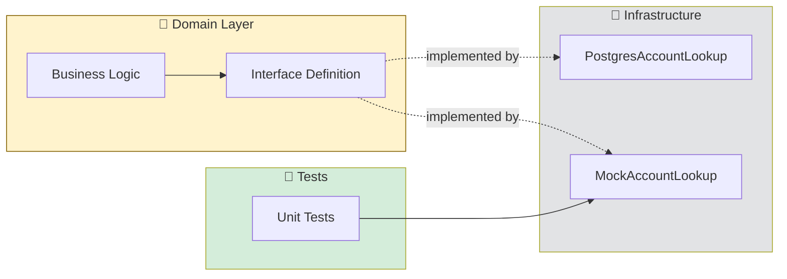

**Options Considered:**

| Option | Pros | Cons |
|--------|------|------|
| A. Global functions (like Python) | Familiar to ERPNext devs | Untestable |
| B. Dependency injection via constructors | Testable, explicit | Verbose |
| **C. Interface-based injection** ✅ | Testable, swappable | Slight indirection |

**Consequences:**
- ✅ Unit tests run in milliseconds (no DB)
- ✅ Can swap PostgreSQL for SQLite in tests
- ✅ Legacy bridge is just another adapter
- ⚠️ More files/types to manage

---

### 2. Typed Sentinel Errors

**Decision:** Define error constants for programmatic error handling.

**Context:**
- Python uses `frappe.throw(message)` with string matching
- Callers can't reliably handle specific errors
- Go's `errors.Is()` enables type-safe error checks

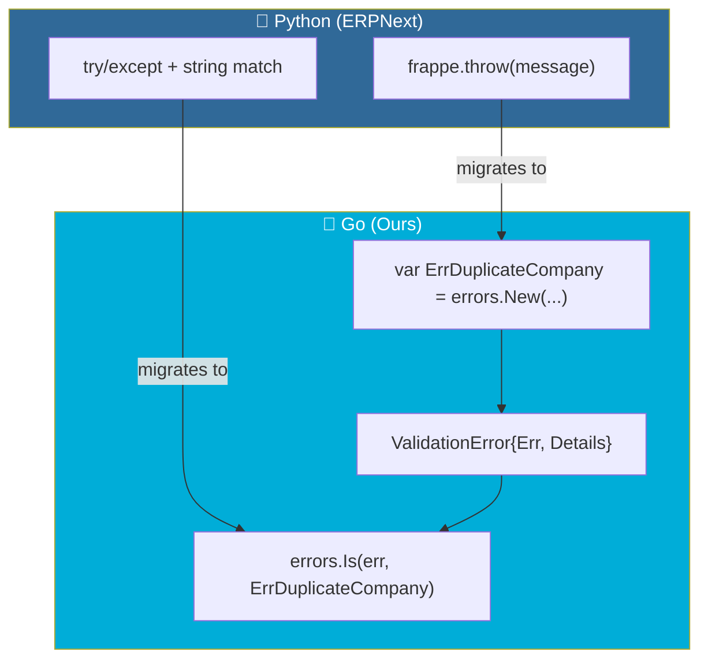

**Options Considered:**

| Option | Pros | Cons |
|--------|------|------|
| A. Return string errors | Simple | No type safety |
| B. Custom error types | Full control | Boilerplate |
| **C. Sentinel errors + wrapper** ✅ | Type-safe, details included | Moderate complexity |

**Consequences:**
- ✅ Callers can handle specific errors
- ✅ Details preserved for logging/display
- ✅ Works with `errors.Is()` and `errors.As()`
- ⚠️ Must remember to use Unwrap()

---

### 3. Table-Driven Tests

**Decision:** Use table-driven tests for comprehensive coverage.

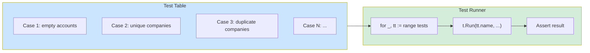

**Options Considered:**

| Option | Pros | Cons |
|--------|------|------|
| A. One function per test | Clear names | Verbose, hard to add cases |
| B. BDD framework (Ginkgo) | Expressive | External dependency |
| **C. Table-driven tests** ✅ | Go idiom, easy to extend | Slightly dense |

**Consequences:**
- ✅ Adding test cases is one line
- ✅ Subtests run in parallel if needed
- ✅ Clear failure messages with test names
- ⚠️ Table setup can be verbose for complex inputs

---

### 4. Domain Purity

**Decision:** Domain structs contain no infrastructure code.

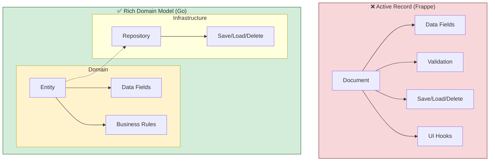

**Consequences:**
- ✅ Domain logic testable without database
- ✅ Same validation works in API, CLI, batch jobs
- ✅ Clear separation of concerns
- ⚠️ More layers (domain, application, infrastructure)

---

### 5. Incremental Migration

**Decision:** Migrate one bounded context at a time with feature flags.

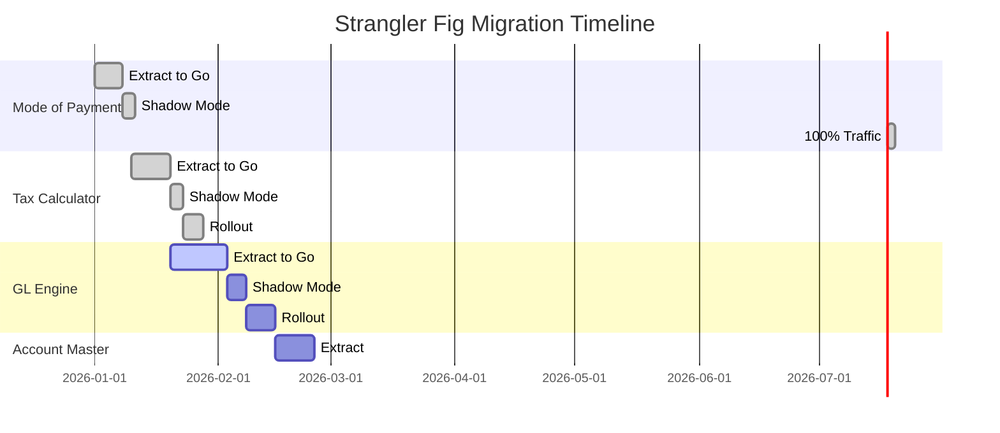

**Consequences:**
- ✅ Production never breaks
- ✅ Rollback is one config change
- ✅ Team learns patterns incrementally
- ⚠️ Two systems running in parallel temporarily

---

## Pattern Catalog

### Patterns Used

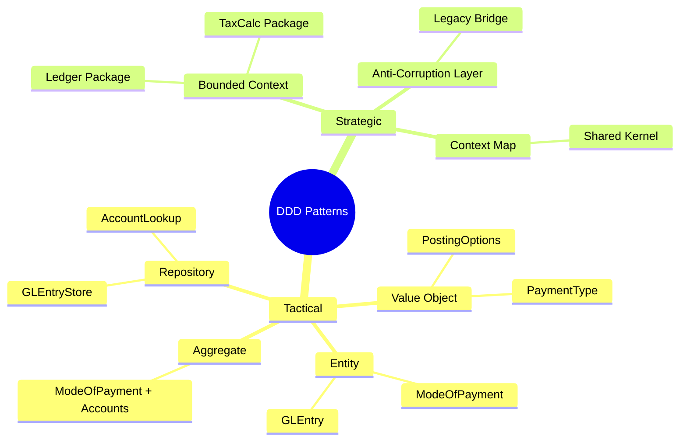

### Pattern Details

#### Repository Pattern

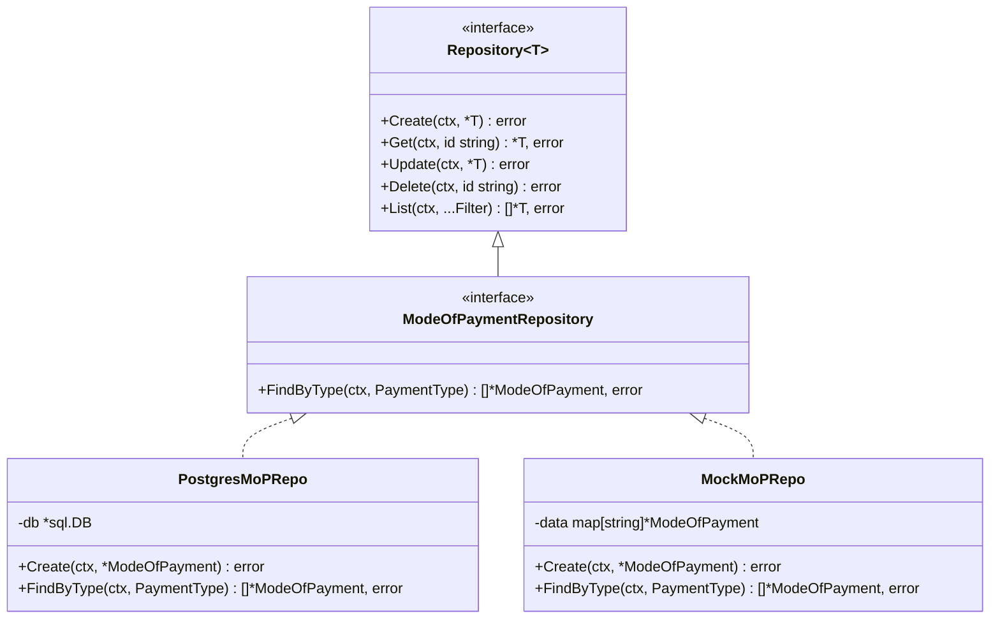

#### Specification Pattern

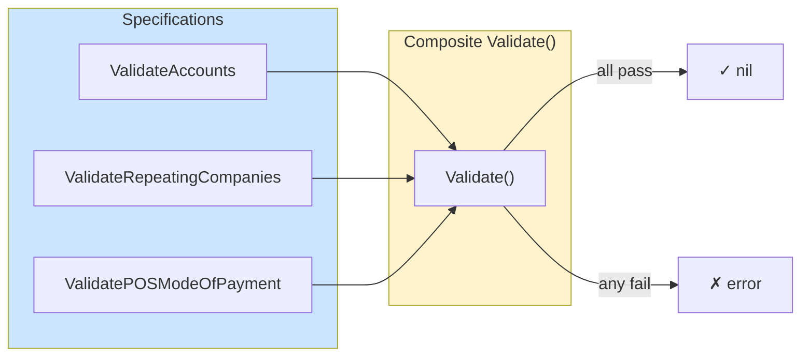

---

## Trade-off Analysis

### Complexity vs Testability

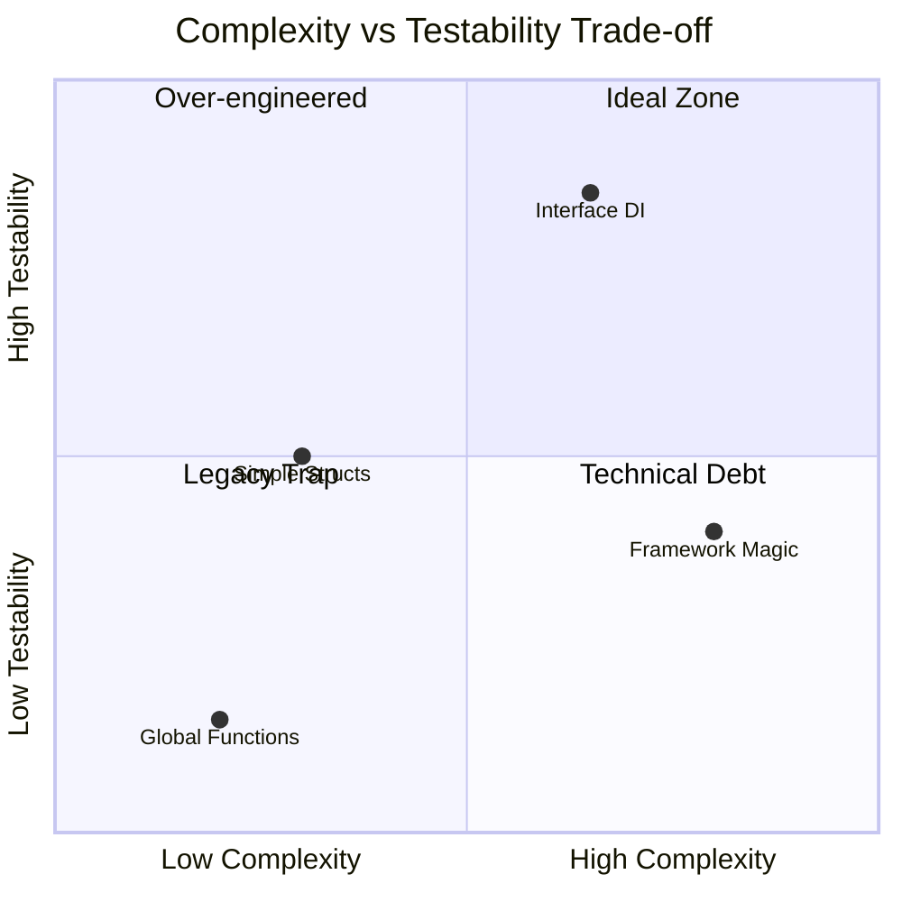

### Performance vs Maintainability

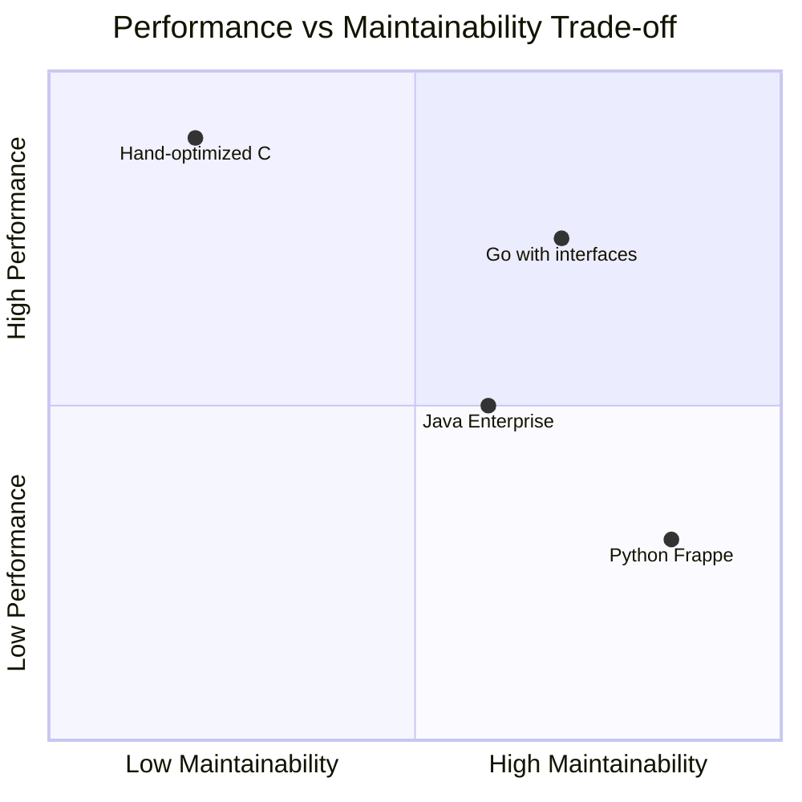

### Migration Speed vs Risk

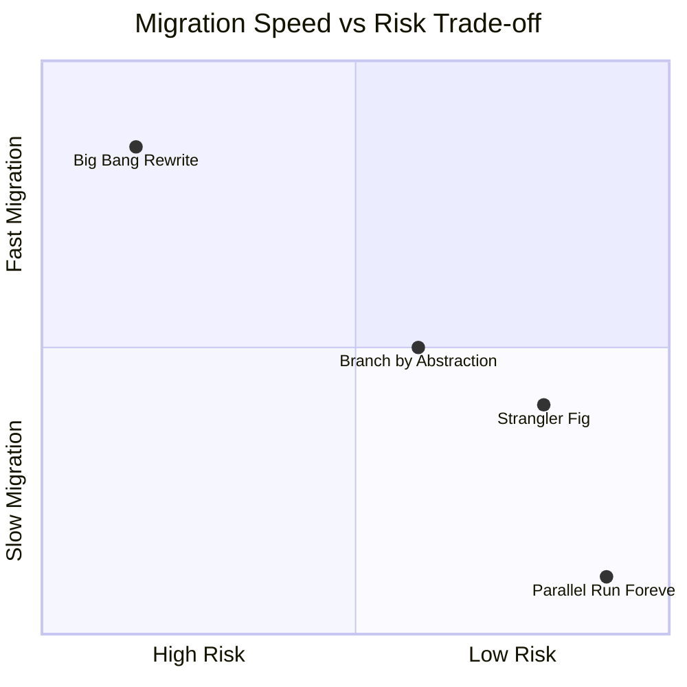

---

## Anti-Patterns to Avoid

### What Not to Do

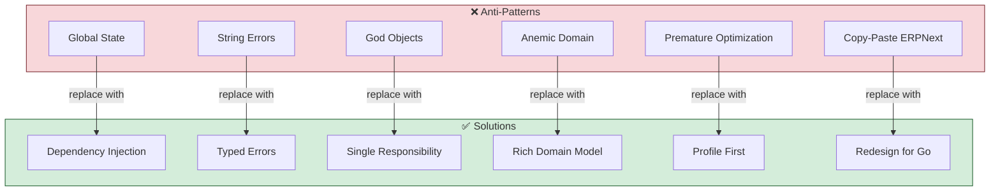

### Code Comparison

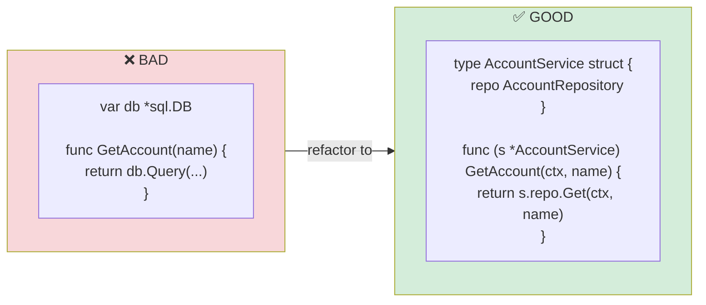

---

## Decision Records

### ADR-001: Use Go for Modernization

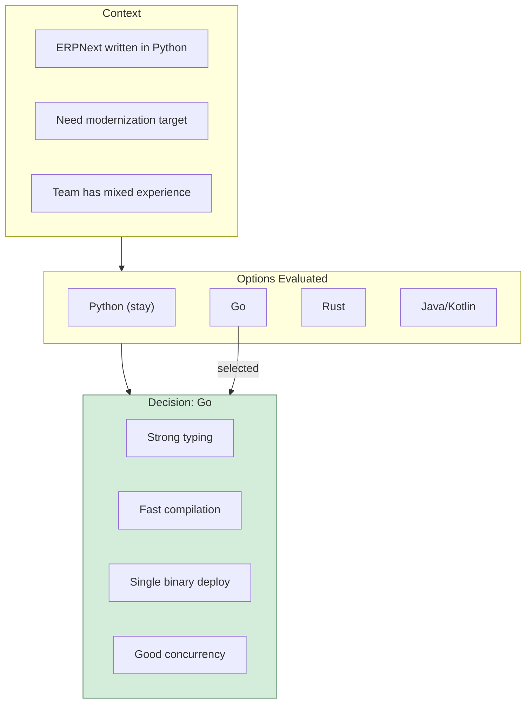

**Status:** Accepted
**Date:** 2026-01-27

### ADR-002: PostgreSQL over MariaDB

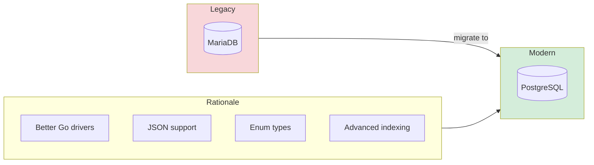

**Status:** Accepted
**Date:** 2026-01-27

### ADR-003: Interface-Based Testing

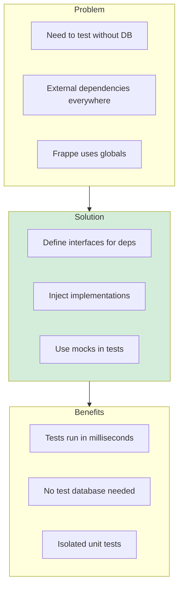

**Status:** Accepted
**Date:** 2026-01-27

---

## References

- [Domain-Driven Design](https://www.domainlanguage.com/ddd/) — Eric Evans
- [Clean Architecture](https://blog.cleancoder.com/uncle-bob/2012/08/13/the-clean-architecture.html) — Robert C. Martin
- [Effective Go](https://golang.org/doc/effective_go) — Go Team
- [Architecture Decision Records](https://adr.github.io/) — ADR GitHub
