# Implementation Guide

> Step-by-step guide to migrating ERPNext DocTypes to Go

---

## Table of Contents

- [Prerequisites](#prerequisites)
- [Migration Workflow](#migration-workflow)
- [Step-by-Step Guide](#step-by-step-guide)
- [Code Patterns](#code-patterns)
- [Testing Strategy](#testing-strategy)
- [Deployment Guide](#deployment-guide)
- [Troubleshooting](#troubleshooting)

---

## Prerequisites

### Development Environment

| Tool | Version | Purpose |
|------|---------|---------|
| Go | 1.21+ | Runtime |
| Git | 2.x | Version control |
| PostgreSQL | 15+ | Database (optional for iteration 1) |
| ERPNext | v14+ | Source system reference |

### Setup Commands

```bash
# Verify Go installation
go version
# go version go1.21.0 darwin/arm64

# Clone repository
git clone git@github.com:senguttuvang/erpnext-go.git
cd erpnext-go

# Run tests to verify setup
go test -v ./...

# Check coverage
go test -cover ./...
```

---

## Migration Workflow

### Overview


### Detailed Workflow


### Checklist

```
□ Phase 1: Analysis
  □ Read Python source code
  □ Identify fields from JSON schema
  □ Document business rules
  □ Note external dependencies

□ Phase 2: Model
  □ Create Go structs
  □ Define type enums
  □ Add field comments

□ Phase 3: Validation
  □ Implement each business rule
  □ Define error types
  □ Create port interfaces

□ Phase 4: Testing
  □ Write table-driven tests
  □ Cover all branches
  □ Verify error messages match

□ Phase 5: Deployment
  □ Add HTTP handlers (if needed)
  □ Configure feature flag
  □ Deploy to shadow mode
  □ Monitor and compare
```

---

## Step-by-Step Guide

### Step 1: Analyze Python Source

**Goal:** Understand what we're migrating.

#### 1.1 Locate the Files

```mermaid
flowchart TB
    subgraph erpnext["erpnext/"]
        subgraph accounts["accounts/"]
            subgraph doctype["doctype/"]
                subgraph mop["mode_of_payment/"]
                    json["mode_of_payment.json<br/>📋 Schema"]
                    py["mode_of_payment.py<br/>🐍 Business Logic"]
                    test["test_mode_of_payment.py<br/>🧪 Tests"]
                    js["mode_of_payment.js<br/>🎨 UI (skip)"]
                end
            end
        end
    end

    json -->|"extract fields"| gomodel["Go Structs"]
    py -->|"extract rules"| govalidation["Go Validation"]
    test -->|"migrate cases"| gotest["Go Tests"]

    style json fill:#cce5ff
    style py fill:#fff3cd
    style test fill:#d4edda
    style js fill:#e2e3e5
```



#### 1.2 Extract Schema from JSON

**Document the mapping:**

| JSON Field | Type | Go Type |
|------------|------|---------|
| `mode_of_payment` | Data (required, unique) | `string` |
| `type` | Select | `PaymentType` (enum) |
| `enabled` | Check | `bool` |
| `accounts` | Table | `[]ModeOfPaymentAccount` |

#### 1.3 Extract Business Rules from Python


#### 1.4 Identify External Dependencies


---

### Step 2: Create Go Models

**Goal:** Define data structures matching the Python schema.

#### 2.1 Package Structure


#### 2.2 Type Definitions

```go
// Package modeofpayment implements the Mode of Payment doctype from ERPNext.
// Migrated from: erpnext/accounts/doctype/mode_of_payment/mode_of_payment.py
package modeofpayment

// PaymentType represents the type of payment method.
// Maps to: type DF.Literal["Cash", "Bank", "General", "Phone"]
type PaymentType string

const (
    Cash    PaymentType = "Cash"
    Bank    PaymentType = "Bank"
    General PaymentType = "General"
    Phone   PaymentType = "Phone"
)
```

---

### Step 3: Implement Validation

**Goal:** Port Python business rules to Go.

#### 3.1 Validation Flow


#### 3.2 Error Hierarchy


---

### Step 4: Write Tests

**Goal:** Prove Go implementation matches Python behavior.

#### 4.1 Test Structure


#### 4.2 Test Coverage Goals


---

## Code Patterns

### Pattern: Field Mapping

| Python (Frappe) | Go |
|-----------------|-----|
| `DF.Data` | `string` |
| `DF.Int` | `int` |
| `DF.Float` | `float64` |
| `DF.Check` | `bool` |
| `DF.Select` | Custom type (enum) |
| `DF.Link` | `string` (stores name/ID) |
| `DF.Table[T]` | `[]T` |
| `DF.Date` | `time.Time` |
| `DF.Datetime` | `time.Time` |
| `DF.Currency` | `decimal.Decimal` |

### Pattern: Error Translation


### Pattern: Database Calls

| Python | Go Interface |
|--------|--------------|
| `frappe.get_value("DocType", name, field)` | `interface { GetField(name) (value, error) }` |
| `frappe.get_cached_value(...)` | Same interface (caching is implementation detail) |
| `frappe.db.sql(query, values)` | Custom interface method for the query |
| `frappe.get_doc("DocType", name)` | `interface { Get(name) (*Entity, error) }` |

---

## Testing Strategy

### Test Pyramid

```mermaid
flowchart TB
    subgraph pyramid["Test Pyramid"]
        e2e["🔝 E2E Tests<br/>Few (manual/automated)<br/>Full system with ERPNext"]

        integration["📊 Integration Tests<br/>Some (with real DB)<br/>Repository & API tests"]

        unit["🧪 Unit Tests<br/>Many (fast, isolated)<br/>Run on every commit"]
    end

    e2e --> integration --> unit

    style e2e fill:#f8d7da,stroke:#721c24
    style integration fill:#fff3cd,stroke:#856404
    style unit fill:#d4edda,stroke:#155724
```



### Coverage Targets

| Layer | Target | Rationale |
|-------|--------|-----------|
| Domain (validation) | 90%+ | Core business logic |
| Application (use cases) | 80%+ | Orchestration logic |
| Infrastructure (repositories) | 70%+ | Integration points |
| HTTP handlers | 60%+ | Mostly delegation |

---

## Deployment Guide

### Shadow Mode Architecture

```mermaid
flowchart TB
    request["📨 Request"] --> gateway["🔀 API Gateway"]

    gateway --> python["🐍 Python<br/>(Primary)"]
    gateway -.->|shadow| go["🔷 Go<br/>(Shadow)"]

    python --> response["📤 Response"]

    go --> comparator["📊 Comparator"]
    response --> comparator

    comparator --> decision{Match?}

    decision -->|Yes| log_match["✅ Log: MATCH"]
    decision -->|No| log_diff["⚠️ Log: DIFF"]

    subgraph config["Configuration"]
        ff["Feature Flag:<br/>shadow_mode: true<br/>rollout: 0%"]
    end

    gateway -.-> config

    style python fill:#306998,color:#fff
    style go fill:#00ADD8,color:#fff
    style comparator fill:#fff3cd
```



### Gradual Rollout Timeline


---

## Troubleshooting

### Common Issues

| Issue | Cause | Solution |
|-------|-------|----------|
| Test fails with "nil pointer" | Uninitialized slice | Use `[]T{}` not `nil` |
| Error types don't match | Missing `Unwrap()` | Implement `Unwrap()` method |
| Coverage drops | Untested error paths | Add error case tests |
| Integration test fails | Mock data out of date | Sync with ERPNext schema |

### Debug Decision Tree


### Debug Commands

```bash
# Verbose test output
go test -v ./...

# Test single function
go test -v -run TestValidateRepeatingCompanies ./modeofpayment/

# Check for race conditions
go test -race ./...

# Profile memory usage
go test -memprofile=mem.out ./...
go tool pprof mem.out
```

---

## Iteration Roadmap


---

## References

- [Testing in Go](https://golang.org/pkg/testing/) — Go Documentation
- [Table-Driven Tests](https://github.com/golang/go/wiki/TableDrivenTests) — Go Wiki
- [Effective Go](https://golang.org/doc/effective_go) — Go Team
