# Intern Contribution Guide

> Your path from "I don't know Go" to "I shipped a feature"

---

## 📍 Current Status: Week 3 of 4

**You are in the Migrate Phase** — the most important part of the internship.

> 📖 **Deep Dive**: For the complete internship framework, see the [AI Engineering Internship Vault](https://github.com/PearlThoughtsInternship/AI-Internship-Vault) which contains detailed guides on:
> - [Week-by-Week Plan](../../../PearlThoughts-Org/HR/Internship/Internship-Obsidian-Vault/AI-Internship/04-Internship/02-Week-by-Week.md)
> - [What You Build](../../../PearlThoughts-Org/HR/Internship/Internship-Obsidian-Vault/AI-Internship/04-Internship/03-What-You-Build.md)
> - [Development Workflow](../../../PearlThoughts-Org/HR/Internship/Internship-Obsidian-Vault/AI-Internship/04-Internship/05-Development-Workflow.md)

---

## ⏰ Internship Timeline

| Week | Phase | Focus | Deliverable |
|------|-------|-------|-------------|
| Week 1 | **Research** | Environment setup, understand ERPNext, read docs | Working local setup |
| Week 2 | **Build** | Implement indexing, exercises, start building tool | First code contributions |
| **Week 3** | **Migrate** ← YOU ARE HERE | Test on real codebase, PRs, validate parity | Working features |
| Week 4 | **Verify & Document** | Measure effectiveness, document learnings | Final demo + evidence |

### Extension Criteria

The internship may be **extended based on your involvement**:

| Factor | What We Look For |
|--------|------------------|
| **Active Participation** | Regular commits, PR reviews, asking questions |
| **Quality Work** | Tests pass, code follows patterns, thoughtful solutions |
| **Communication** | Responsive in Teams/GitHub, attends sync meetings |
| **Initiative** | Proposes improvements, helps other interns |
| **Learning Velocity** | Shows growth, applies feedback quickly |

**If extending**: Focus shifts to deeper features, leading reviews, mentoring newer interns.

---

## 🗣️ Communication Protocols

### Primary Channels

| Channel | Use For | Response Time |
|---------|---------|---------------|
| **GitHub Issues** | Technical questions, code discussions | Within 24 hours |
| **GitHub PR Reviews** | Code feedback, approvals | Within 24 hours |
| **Teams (General)** | Announcements, general discussion | Check daily |
| **Teams (Support)** | Help requests, blockers | Same day if urgent |
| **Discord** | Casual discussion, peer help | Best effort |

### Communication Expectations

**Research First, Ask Second** (The "Rainforest Test"):
1. Search existing docs/code for 10 minutes
2. Try to solve it yourself
3. If still stuck, ask with context:
   - What you're trying to do
   - What you've tried
   - Specific error/blocker

**Good Question Example**:
> "I'm implementing `ValidateBalance()` in exercise 2. Running `go test` gives `expected true, got false` on line 45. I checked the mock data and 'Sales - ACME' is present. What am I missing?"

**Bad Question Example**:
> "It doesn't work"

### Weekly Sync

- **When**: Friday demos with mentor
- **Format**: Show what you built, discuss blockers, plan next week
- **Preparation**: Update progress in your PR or issue comments

---

## 🎯 Active Participation Requirements

### Minimum Expectations (Week 3)

| Requirement | Frequency |
|-------------|-----------|
| Commit meaningful code | 3+ times per week |
| Respond to PR comments | Within 24 hours |
| Post progress update | Weekly in Teams or GitHub |
| Attend weekly sync | Every Friday |
| Review peer PRs (optional but encouraged) | 1-2 per week |

### Signs of Strong Participation

✅ Asks clarifying questions before implementing
✅ Proposes solutions, not just reports problems
✅ Helps other interns in chat
✅ Commits small, focused PRs (10-50 lines, not 1000)
✅ Responds to feedback positively and quickly

### Signs of Weak Participation

❌ Silent for days with no updates
❌ Large "dump" PRs with many unrelated changes
❌ Ignoring review comments
❌ Not asking for help when stuck (suffer in silence)
❌ Skipping weekly syncs without notice

---

## 🧠 The Core Insight: Bounded Context Strategy

> *"I want to extract the Accounts module, but it depends on Stock, Selling, and other modules. Don't I need to migrate everything at once?"*
>
> **No.** This is the core insight from Sam Newman's *Monolith to Microservices* and Michael Feathers' *Working Effectively with Legacy Code*.

**Read the [main README](../README.md#but-the-accounts-module-has-dependencies) for the full diagram.**

### The Key Pattern: Interface-Based Isolation

```
┌─────────────────────────────────────────────────────────────────────────────┐
│  HOW TO EXTRACT A MODULE WITH DEPENDENCIES                                   │
├─────────────────────────────────────────────────────────────────────────────┤
│                                                                              │
│  PROBLEM: GL Entry Engine needs Account data, Company settings, Budget...   │
│                                                                              │
│  SOLUTION: Define INTERFACES at the boundary                                │
│                                                                              │
│     type AccountLookup interface {                                          │
│         GetAccount(name string) (*Account, error)                           │
│         IsDisabled(name string) (bool, error)                               │
│     }                                                                        │
│                                                                              │
│  Now the GL Entry Engine:                                                   │
│  • Works with ANY implementation (mock, real DB, API)                       │
│  • Can be tested in isolation (milliseconds, not minutes)                   │
│  • Can be migrated incrementally (Strangler Fig Pattern)                    │
│                                                                              │
└─────────────────────────────────────────────────────────────────────────────┘
```

### Why This Matters for Your Work

| Book | Author | Pattern You'll Learn |
|------|--------|---------------------|
| **Monolith to Microservices** | Sam Newman | Strangler Fig, Branch by Abstraction |
| **Working Effectively with Legacy Code** | Michael Feathers | Seams, Characterization Tests |
| **Domain-Driven Design** | Eric Evans | Bounded Contexts, Anti-Corruption Layer |
| **Clean Architecture** | Robert C. Martin | Ports & Adapters, Dependency Inversion |

**Each exercise teaches you one of these patterns.**

---

## 🎯 The Big Picture: Two Parallel Goals

You're learning **two things simultaneously**:

### Goal 1: Legacy Modernization Architecture

The exercises teach you the **patterns** that make incremental migration possible:
- **Interface isolation** (Exercise 3: Repository Pattern)
- **Test doubles** (Exercise 2, 3, 4: Mocks, Stubs, Fakes)
- **Parity verification** (Exercise 4: Prove Go = Python)

### Goal 2: Code Intelligence for AI Assistants

Your Code Intelligence Platform will **extract** and **explain** these patterns:
- **Entity extraction** (Exercise 1: GLEntry struct → your tool parses these)
- **Business rule identification** (Exercise 2: Validation → your tool finds these)
- **Dependency mapping** (Exercise 3: Interfaces → your tool traces these)
- **Parity metrics** (Exercise 4: Your tool's success measure)

```
┌─────────────────────────────────────────────────────────────────────────────┐
│  THE CONNECTION                                                              │
├─────────────────────────────────────────────────────────────────────────────┤
│                                                                              │
│  You can't build tools that extract what you don't understand.              │
│                                                                              │
│  By DOING the modernization (exercises), you learn:                         │
│  • What patterns exist in legacy code                                       │
│  • What makes code extractable vs entangled                                 │
│  • What AI assistants need to generate correct code                         │
│                                                                              │
│  Then your Code Intelligence tool can:                                      │
│  • Identify these patterns automatically                                    │
│  • Provide focused context to AI assistants                                 │
│  • Enable accurate code generation                                          │
│                                                                              │
└─────────────────────────────────────────────────────────────────────────────┘
```

### How This Repository Fits In

| Repository | Purpose | Your Role |
|------------|---------|-----------|
| **erpnext-go** (this repo) | Demonstrates bounded context extraction | Learn the patterns |
| **Your Tool** (you build) | Code Intelligence Platform | Extract & explain patterns |
| **ERPNext** (Python source) | Legacy codebase to analyze | Your tool's input |

---

## Welcome!

This guide is designed for interns who want to contribute to the ERPNext modernization project. You don't need to understand everything—just follow the steps, and you'll learn as you go.

```mermaid
flowchart LR
    subgraph week1["Week 1"]
        setup["🛠️ Setup"]
        tour["🗺️ CodeTour"]
        ex1["📝 Exercise 1"]
    end

    subgraph week2["Week 2"]
        ex2["📝 Exercise 2"]
        ex3["📝 Exercise 3"]
        gfi["🎯 Good First Issue"]
    end

    subgraph week3["Week 3 ⭐"]
        pr["🚀 First PR"]
        review["👀 Code Review"]
        merge["✅ Merged!"]
    end

    week1 --> week2 --> week3

    style week1 fill:#e3f2fd
    style week2 fill:#fff3cd
    style week3 fill:#d4edda
```



---

## Quick Start (15 minutes)

### Step 1: Clone and Setup

```bash
# Clone the repository
git clone git@github.com:PearlThoughtsInternship/erpnext-go.git
cd erpnext-go

# Verify Go is installed (need Go 1.21+)
go version

# Run tests to make sure everything works
go test ./...
```

**Expected output:** `ok` for all packages, 68 tests passing.

### Step 2: Install VS Code Extensions

Open VS Code and install these extensions:

| Extension | Purpose |
|-----------|---------|
| **CodeTour** | Guided codebase walkthrough |
| **Go** | Go language support |
| **Error Lens** | See errors inline |

### Step 3: Take the CodeTour

1. Open the project in VS Code
2. Press `Ctrl+Shift+P` (or `Cmd+Shift+P` on Mac)
3. Type "CodeTour: Start Tour"
4. Select "01-architecture-overview"

The tour will guide you through the codebase step-by-step.

---

## Learning Path

```mermaid
graph TD
    A["🎯 Start Here"] --> B["Exercise 1:<br/>GLEntry Struct"]
    B --> C["Exercise 2:<br/>Validation Function"]
    C --> D["Exercise 3:<br/>Repository Pattern"]
    D --> E["Exercise 4:<br/>Integration Test"]
    E --> F["🏆 Ready for<br/>Good First Issue!"]

    style A fill:#4CAF50,color:#fff
    style F fill:#2196F3,color:#fff
```



### How Each Exercise Connects to Both Goals

| Exercise | Architectural Pattern (Goal 1) | Code Intelligence (Goal 2) |
|----------|-------------------------------|---------------------------|
| 🟢 **1. GLEntry Struct** | **Domain Modeling** — Understand the core entity | Your AST parser must extract entities like this |
| 🟡 **2. Validation** | **Characterization Test** — Capture existing behavior | Your tool finds business rules in `frappe.throw()` patterns |
| 🟡 **3. Repository** | **Ports & Adapters** — Interface-based isolation | Your tool uses same pattern for pluggable vector storage |
| 🔴 **4. Integration Test** | **Parity Verification** — Prove Go = Python | **This IS your tool's success metric** |

> 📚 **Key Reference**: The [main README](../README.md) has the full architectural diagrams. Read "But The Accounts Module Has Dependencies!" section before starting exercises.

> 💡 **The Connection**: You can't build tools that extract what you don't understand. By DOING the modernization, you learn what patterns exist in legacy code — then your Code Intelligence tool can identify them automatically.

### Exercise Difficulty Levels

| Level | Description | Time |
|-------|-------------|------|
| 🟢 **Beginner** | Fill in struct fields, simple functions | 30 min |
| 🟡 **Intermediate** | Implement validation, write tests | 1-2 hours |
| 🔴 **Advanced** | Full feature implementation | Half day |

---

## Exercise 1: Complete the GLEntry Struct (🟢 Beginner)

**Goal:** Learn the GLEntry data structure by completing missing fields.

**Location:** `exercises/01-glentry-struct/`

```bash
# Navigate to exercise
cd exercises/01-glentry-struct

# Read the instructions
cat README.md

# Open the file to complete
code glentry.go

# Run tests to check your work
go test -v
```

**What you'll do:**
1. Open `glentry.go` - you'll see a partial struct with `// TODO` comments
2. Fill in the missing fields based on the comments
3. Run `go test` - tests will pass when you're done correctly

**Success criteria:** All tests pass ✅

---

## Exercise 2: Implement Validation (🟡 Intermediate)

**Goal:** Write a function that validates GL entries balance.

**Location:** `exercises/02-validation/`

```bash
cd exercises/02-validation
cat README.md
code validation.go
go test -v
```

**What you'll do:**
1. Implement `ValidateBalance()` function
2. Handle edge cases (empty slice, single entry)
3. Use the provided helper functions

---

## Exercise 3: Repository Pattern (🟡 Intermediate)

**Goal:** Implement a simple in-memory repository.

**Location:** `exercises/03-repository/`

**What you'll learn:**
- Interface-based design
- Dependency injection
- Go's implicit interface implementation

---

## Exercise 4: Write an Integration Test (🔴 Advanced)

**Goal:** Write a realistic test scenario like `TestRealisticSalesInvoiceGLEntries`.

**Location:** `exercises/04-integration-test/`

**What you'll learn:**
- Table-driven testing
- Mock implementations
- Parity verification approach

---

## Good First Issues

After completing exercises, you're ready for real contributions!

### Finding Issues

1. Go to [GitHub Issues](https://github.com/PearlThoughtsInternship/erpnext-go/issues)
2. Filter by label: `good-first-issue`
3. Look for issues tagged with your skill level

### Issue Labels Explained

| Label | Meaning |
|-------|---------|
| `good-first-issue` | Perfect for beginners |
| `help-wanted` | We need contributors |
| `documentation` | Docs improvement |
| `test` | Add or improve tests |
| `enhancement` | New feature |

### Claiming an Issue

1. Comment "I'd like to work on this" on the issue
2. Wait for assignment (usually within 24 hours)
3. Ask questions if anything is unclear!

---

## Your First Pull Request

### Workflow

```mermaid
sequenceDiagram
    participant You
    participant Fork
    participant Main as Main Repo
    participant CI

    You->>Fork: 1. Fork repository
    You->>Fork: 2. Create branch
    You->>Fork: 3. Make changes
    You->>Fork: 4. Run tests locally
    Fork->>Main: 5. Open PR
    Main->>CI: 6. CI runs tests
    CI-->>Main: 7. Tests pass ✅
    Main->>You: 8. Code review
    You->>Fork: 9. Address feedback
    Main->>Main: 10. Merge! 🎉
```



### Step-by-Step

```bash
# 1. Create a branch for your work
git checkout -b feat/your-feature-name

# 2. Make your changes
# ... edit files ...

# 3. Run tests
go test ./...

# 4. Run linter
go vet ./...

# 5. Commit with a good message
git add .
git commit -m "feat: add validation for disabled accounts

- Implement validateDisabledAccounts function
- Add unit tests for valid and invalid cases
- Update documentation

Co-Authored-By: Your Name <your.email@example.com>"

# 6. Push to your fork
git push origin feat/your-feature-name

# 7. Open PR on GitHub
```

### PR Checklist

Before submitting, verify:

- [ ] Tests pass locally (`go test ./...`)
- [ ] No linting errors (`go vet ./...`)
- [ ] Code is formatted (`go fmt ./...`)
- [ ] Added tests for new functionality
- [ ] Updated documentation if needed
- [ ] Commit message follows convention

---

## Getting Help

### When You're Stuck

```mermaid
flowchart TD
    stuck["😕 I'm stuck!"]

    stuck --> doc["1. Check documentation (10 min)"]
    doc --> found["Found answer?"]
    found -->|Yes| continue["✅ Continue"]
    found -->|No| search["2. Search existing code"]

    search --> pattern["Found similar pattern?"]
    pattern -->|Yes| adapt["Adapt to your case"]
    pattern -->|No| ask["3. Ask for help (with context!)"]

    ask --> github["GitHub Issue/PR comment"]
    github --> teams["Or Teams Support channel"]
    teams --> mentor["Mentor responds within 24h"]
```



### Help Channels (Updated)

| Channel | When to Use | Response Time |
|---------|-------------|---------------|
| **GitHub Issue Comments** | Technical questions about code | Within 24 hours |
| **Teams General** | Announcements, non-urgent discussion | Check daily |
| **Teams Support** | Blockers, urgent help requests | Same day |
| **Discord** | Peer help, casual questions | Best effort |
| **Weekly Sync (Friday)** | Progress updates, blockers | Synchronous |

> ⚠️ **Note**: Teams chat permissions are being fixed by HR. If you can't send messages, use **GitHub Issues** or **Discord** as alternatives.

### Asking Good Questions

**Bad question:**
> "It doesn't work"

**Good question:**
> "I'm trying to implement `validateDisabledAccounts` in exercise 2. When I run `go test`, I get this error: `expected true, got false` on line 45. I've checked that the account 'Sales - ACME' is in my mock data. What am I missing?"

Include:
1. What you're trying to do
2. What you expected to happen
3. What actually happened
4. What you've already tried

---

## Code Patterns Cheat Sheet

### Pattern 1: Table-Driven Tests

```go
func TestSomething(t *testing.T) {
    tests := []struct {
        name     string      // Describe the test case
        input    InputType   // Test input
        expected OutputType  // Expected result
    }{
        {
            name:     "valid_input",
            input:    InputType{...},
            expected: OutputType{...},
        },
        // Add more cases here
    }

    for _, tt := range tests {
        t.Run(tt.name, func(t *testing.T) {
            result := FunctionUnderTest(tt.input)
            if result != tt.expected {
                t.Errorf("got %v, want %v", result, tt.expected)
            }
        })
    }
}
```

### Pattern 2: Interface + Mock

```go
// 1. Define interface (what we need)
type AccountLookup interface {
    GetAccount(name string) (*Account, error)
}

// 2. Create mock for tests
type mockAccountLookup struct {
    accounts map[string]*Account
}

func (m *mockAccountLookup) GetAccount(name string) (*Account, error) {
    if acc, ok := m.accounts[name]; ok {
        return acc, nil
    }
    return nil, fmt.Errorf("account not found: %s", name)
}

// 3. Use in tests
func TestWithMock(t *testing.T) {
    mock := &mockAccountLookup{
        accounts: map[string]*Account{
            "Sales - ACME": {Name: "Sales - ACME", Disabled: false},
        },
    }

    engine := &Engine{Accounts: mock}
    // Now test with controlled data
}
```

### Pattern 3: Error Handling

```go
// Define typed error
type ValidationError struct {
    Field   string
    Message string
}

func (e *ValidationError) Error() string {
    return fmt.Sprintf("%s: %s", e.Field, e.Message)
}

// Use it
func Validate(entry GLEntry) error {
    if entry.Account == "" {
        return &ValidationError{
            Field:   "Account",
            Message: "account is required",
        }
    }
    return nil
}

// Check specific error type in tests
var validationErr *ValidationError
if errors.As(err, &validationErr) {
    // Handle validation error
}
```

---

## Glossary

| Term | Meaning |
|------|---------|
| **GL Entry** | General Ledger Entry - a single accounting record |
| **Debit/Credit** | The two sides of an accounting entry (must balance) |
| **DocType** | ERPNext term for a data model/table |
| **Port** | Interface defining what a component needs |
| **Adapter** | Implementation of a port interface |
| **Mock** | Fake implementation for testing |
| **Parity** | Python and Go producing identical results |

---

## Progress Tracker

Copy this to your notes and check off as you complete:

```
## My Progress

### Setup
- [ ] Cloned repository
- [ ] Installed VS Code extensions
- [ ] Ran tests successfully

### CodeTours
- [ ] 01-architecture-overview
- [ ] 02-adding-tests
- [ ] 03-gl-entry-flow

### Exercises
- [ ] Exercise 1: GLEntry Struct
- [ ] Exercise 2: Validation
- [ ] Exercise 3: Repository
- [ ] Exercise 4: Integration Test

### Contributions
- [ ] First Good First Issue claimed
- [ ] First PR submitted
- [ ] First PR merged! 🎉
```

---

## Recognition

Contributors are recognized in:

1. **Git history** - Your name on commits forever
2. **Contributors list** - Added to README
3. **LinkedIn recommendation** - For significant contributions

Keep building, keep learning! 🚀

---

## 📚 Cross-References (AI Engineering Internship)

This repository is part of the **AI Engineering Internship Program**. For comprehensive guides and deeper context, see:

### Internship Framework (Obsidian Vault)

| Document | What You'll Learn |
|----------|-------------------|
| [Before You Begin](https://github.com/PearlThoughtsInternship/AI-Internship-Vault/blob/main/04-Internship/01-Before-You-Begin.md) | Expectations, the "Rainforest Test" |
| [Week-by-Week Plan](https://github.com/PearlThoughtsInternship/AI-Internship-Vault/blob/main/04-Internship/02-Week-by-Week.md) | Detailed weekly objectives and deliverables |
| [What You Build](https://github.com/PearlThoughtsInternship/AI-Internship-Vault/blob/main/04-Internship/03-What-You-Build.md) | Tool forms, language choices, AI infrastructure |
| [Your Role](https://github.com/PearlThoughtsInternship/AI-Internship-Vault/blob/main/04-Internship/04-Your-Role.md) | How you fit in Team Topologies |
| [Development Workflow](https://github.com/PearlThoughtsInternship/AI-Internship-Vault/blob/main/04-Internship/05-Development-Workflow.md) | End-to-end workflow with evidence collection |

### Technical Deep Dives

| Document | What You'll Learn |
|----------|-------------------|
| [Code Intelligence Overview](https://github.com/PearlThoughtsInternship/AI-Internship-Vault/blob/main/02-Engineering/Code-Intelligence/01-What-Is-Code-Intelligence.md) | Why code intelligence matters |
| [DDD Patterns](https://github.com/PearlThoughtsInternship/AI-Internship-Vault/blob/main/02-Engineering/Domain-Knowledge/01-Why-DDD-Matters.md) | Domain-driven design for migrations |
| [Quality Metrics](https://github.com/PearlThoughtsInternship/AI-Internship-Vault/blob/main/03-AI-Platform/04-Quality-Metrics.md) | How to measure your tool's effectiveness |
| [Sales Invoice Case Study](https://github.com/PearlThoughtsInternship/AI-Internship-Vault/blob/main/05-Worked-Examples/01-Sales-Invoice-Case-Study.md) | Detailed example of migration approach |

### Contributing

| Document | What You'll Learn |
|----------|-------------------|
| [How to Contribute](https://github.com/PearlThoughtsInternship/AI-Internship-Vault/blob/main/05-Contributions/01-How-To-Contribute.md) | Code, experiments, documentation contributions |
| [Cohort Reviews](https://github.com/PearlThoughtsInternship/AI-Internship-Vault/tree/main/05-Contributions/Reviews) | Current cohort progress and feedback |

---

*Last Updated: 2026-01-28*
