# Intern Contribution Guide

> Your path from "I don't know Go" to "I shipped a feature"

---

## Welcome!

This guide is designed for interns who want to contribute to the ERPNext modernization project. You don't need to understand everything—just follow the steps, and you'll learn as you go.

```mermaid
flowchart LR
    subgraph week1["Week 1"]
        setup["🛠️ Setup"]
        tour["🗺️ CodeTour"]
        ex1["📝 Exercise 1"]
    end

    subgraph week2["Week 2"]
        ex2["📝 Exercise 2"]
        ex3["📝 Exercise 3"]
        gfi["🎯 Good First Issue"]
    end

    subgraph week3["Week 3+"]
        pr["🚀 First PR"]
        review["👀 Code Review"]
        merge["✅ Merged!"]
    end

    week1 --> week2 --> week3

    style week1 fill:#e3f2fd
    style week2 fill:#fff3cd
    style week3 fill:#d4edda
```



---

## Quick Start (15 minutes)

### Step 1: Clone and Setup

```bash
# Clone the repository
git clone git@github.com:PearlThoughtsInternship/erpnext-go.git
cd erpnext-go

# Verify Go is installed (need Go 1.21+)
go version

# Run tests to make sure everything works
go test ./...
```

**Expected output:** `ok` for all packages, 68 tests passing.

### Step 2: Install VS Code Extensions

Open VS Code and install these extensions:

| Extension | Purpose |
|-----------|---------|
| **CodeTour** | Guided codebase walkthrough |
| **Go** | Go language support |
| **Error Lens** | See errors inline |

### Step 3: Take the CodeTour

1. Open the project in VS Code
2. Press `Ctrl+Shift+P` (or `Cmd+Shift+P` on Mac)
3. Type "CodeTour: Start Tour"
4. Select "01-architecture-overview"

The tour will guide you through the codebase step-by-step.

---

## Learning Path

```mermaid
graph TD
    A["🎯 Start Here"] --> B["Exercise 1:<br/>GLEntry Struct"]
    B --> C["Exercise 2:<br/>Validation Function"]
    C --> D["Exercise 3:<br/>Repository Pattern"]
    D --> E["Exercise 4:<br/>Integration Test"]
    E --> F["🏆 Ready for<br/>Good First Issue!"]

    style A fill:#4CAF50,color:#fff
    style F fill:#2196F3,color:#fff
```



### Exercise Difficulty Levels

| Level | Description | Time |
|-------|-------------|------|
| 🟢 **Beginner** | Fill in struct fields, simple functions | 30 min |
| 🟡 **Intermediate** | Implement validation, write tests | 1-2 hours |
| 🔴 **Advanced** | Full feature implementation | Half day |

---

## Exercise 1: Complete the GLEntry Struct (🟢 Beginner)

**Goal:** Learn the GLEntry data structure by completing missing fields.

**Location:** `exercises/01-glentry-struct/`

```bash
# Navigate to exercise
cd exercises/01-glentry-struct

# Read the instructions
cat README.md

# Open the file to complete
code glentry.go

# Run tests to check your work
go test -v
```

**What you'll do:**
1. Open `glentry.go` - you'll see a partial struct with `// TODO` comments
2. Fill in the missing fields based on the comments
3. Run `go test` - tests will pass when you're done correctly

**Success criteria:** All tests pass ✅

---

## Exercise 2: Implement Validation (🟡 Intermediate)

**Goal:** Write a function that validates GL entries balance.

**Location:** `exercises/02-validation/`

```bash
cd exercises/02-validation
cat README.md
code validation.go
go test -v
```

**What you'll do:**
1. Implement `ValidateBalance()` function
2. Handle edge cases (empty slice, single entry)
3. Use the provided helper functions

---

## Exercise 3: Repository Pattern (🟡 Intermediate)

**Goal:** Implement a simple in-memory repository.

**Location:** `exercises/03-repository/`

**What you'll learn:**
- Interface-based design
- Dependency injection
- Go's implicit interface implementation

---

## Exercise 4: Write an Integration Test (🔴 Advanced)

**Goal:** Write a realistic test scenario like `TestRealisticSalesInvoiceGLEntries`.

**Location:** `exercises/04-integration-test/`

**What you'll learn:**
- Table-driven testing
- Mock implementations
- Parity verification approach

---

## Good First Issues

After completing exercises, you're ready for real contributions!

### Finding Issues

1. Go to [GitHub Issues](https://github.com/PearlThoughtsInternship/erpnext-go/issues)
2. Filter by label: `good-first-issue`
3. Look for issues tagged with your skill level

### Issue Labels Explained

| Label | Meaning |
|-------|---------|
| `good-first-issue` | Perfect for beginners |
| `help-wanted` | We need contributors |
| `documentation` | Docs improvement |
| `test` | Add or improve tests |
| `enhancement` | New feature |

### Claiming an Issue

1. Comment "I'd like to work on this" on the issue
2. Wait for assignment (usually within 24 hours)
3. Ask questions if anything is unclear!

---

## Your First Pull Request

### Workflow

```mermaid
sequenceDiagram
    participant You
    participant Fork
    participant Main as Main Repo
    participant CI

    You->>Fork: 1. Fork repository
    You->>Fork: 2. Create branch
    You->>Fork: 3. Make changes
    You->>Fork: 4. Run tests locally
    Fork->>Main: 5. Open PR
    Main->>CI: 6. CI runs tests
    CI-->>Main: 7. Tests pass ✅
    Main->>You: 8. Code review
    You->>Fork: 9. Address feedback
    Main->>Main: 10. Merge! 🎉
```



### Step-by-Step

```bash
# 1. Create a branch for your work
git checkout -b feat/your-feature-name

# 2. Make your changes
# ... edit files ...

# 3. Run tests
go test ./...

# 4. Run linter
go vet ./...

# 5. Commit with a good message
git add .
git commit -m "feat: add validation for disabled accounts

- Implement validateDisabledAccounts function
- Add unit tests for valid and invalid cases
- Update documentation

Co-Authored-By: Your Name <your.email@example.com>"

# 6. Push to your fork
git push origin feat/your-feature-name

# 7. Open PR on GitHub
```

### PR Checklist

Before submitting, verify:

- [ ] Tests pass locally (`go test ./...`)
- [ ] No linting errors (`go vet ./...`)
- [ ] Code is formatted (`go fmt ./...`)
- [ ] Added tests for new functionality
- [ ] Updated documentation if needed
- [ ] Commit message follows convention

---

## Getting Help

### When You're Stuck

```mermaid
flowchart TD
    stuck["😕 I'm stuck!"]

    stuck --> doc["1. Check documentation"]
    doc --> found["Found answer?"]
    found -->|Yes| continue["✅ Continue"]
    found -->|No| search["2. Search existing code"]

    search --> pattern["Found similar pattern?"]
    pattern -->|Yes| adapt["Adapt to your case"]
    pattern -->|No| ask["3. Ask for help"]

    ask --> slack["Post in #interns channel"]
    slack --> mentor["Mentor responds"]
    mentor --> pair["4. Pair programming session"]
```



### Help Channels

| Channel | When to Use |
|---------|-------------|
| **GitHub Issue Comments** | Questions about specific issues |
| **Slack #interns** | General questions, daily standup |
| **Pair Programming** | When stuck for 30+ minutes |
| **Weekly Sync** | Progress updates, blockers |

### Asking Good Questions

**Bad question:**
> "It doesn't work"

**Good question:**
> "I'm trying to implement `validateDisabledAccounts` in exercise 2. When I run `go test`, I get this error: `expected true, got false` on line 45. I've checked that the account 'Sales - ACME' is in my mock data. What am I missing?"

Include:
1. What you're trying to do
2. What you expected to happen
3. What actually happened
4. What you've already tried

---

## Code Patterns Cheat Sheet

### Pattern 1: Table-Driven Tests

```go
func TestSomething(t *testing.T) {
    tests := []struct {
        name     string      // Describe the test case
        input    InputType   // Test input
        expected OutputType  // Expected result
    }{
        {
            name:     "valid_input",
            input:    InputType{...},
            expected: OutputType{...},
        },
        // Add more cases here
    }

    for _, tt := range tests {
        t.Run(tt.name, func(t *testing.T) {
            result := FunctionUnderTest(tt.input)
            if result != tt.expected {
                t.Errorf("got %v, want %v", result, tt.expected)
            }
        })
    }
}
```

### Pattern 2: Interface + Mock

```go
// 1. Define interface (what we need)
type AccountLookup interface {
    GetAccount(name string) (*Account, error)
}

// 2. Create mock for tests
type mockAccountLookup struct {
    accounts map[string]*Account
}

func (m *mockAccountLookup) GetAccount(name string) (*Account, error) {
    if acc, ok := m.accounts[name]; ok {
        return acc, nil
    }
    return nil, fmt.Errorf("account not found: %s", name)
}

// 3. Use in tests
func TestWithMock(t *testing.T) {
    mock := &mockAccountLookup{
        accounts: map[string]*Account{
            "Sales - ACME": {Name: "Sales - ACME", Disabled: false},
        },
    }

    engine := &Engine{Accounts: mock}
    // Now test with controlled data
}
```

### Pattern 3: Error Handling

```go
// Define typed error
type ValidationError struct {
    Field   string
    Message string
}

func (e *ValidationError) Error() string {
    return fmt.Sprintf("%s: %s", e.Field, e.Message)
}

// Use it
func Validate(entry GLEntry) error {
    if entry.Account == "" {
        return &ValidationError{
            Field:   "Account",
            Message: "account is required",
        }
    }
    return nil
}

// Check specific error type in tests
var validationErr *ValidationError
if errors.As(err, &validationErr) {
    // Handle validation error
}
```

---

## Glossary

| Term | Meaning |
|------|---------|
| **GL Entry** | General Ledger Entry - a single accounting record |
| **Debit/Credit** | The two sides of an accounting entry (must balance) |
| **DocType** | ERPNext term for a data model/table |
| **Port** | Interface defining what a component needs |
| **Adapter** | Implementation of a port interface |
| **Mock** | Fake implementation for testing |
| **Parity** | Python and Go producing identical results |

---

## Progress Tracker

Copy this to your notes and check off as you complete:

```
## My Progress

### Setup
- [ ] Cloned repository
- [ ] Installed VS Code extensions
- [ ] Ran tests successfully

### CodeTours
- [ ] 01-architecture-overview
- [ ] 02-adding-tests
- [ ] 03-gl-entry-flow

### Exercises
- [ ] Exercise 1: GLEntry Struct
- [ ] Exercise 2: Validation
- [ ] Exercise 3: Repository
- [ ] Exercise 4: Integration Test

### Contributions
- [ ] First Good First Issue claimed
- [ ] First PR submitted
- [ ] First PR merged! 🎉
```

---

## Recognition

Contributors are recognized in:

1. **Git history** - Your name on commits forever
2. **Contributors list** - Added to README
3. **LinkedIn recommendation** - For significant contributions

Keep building, keep learning! 🚀
